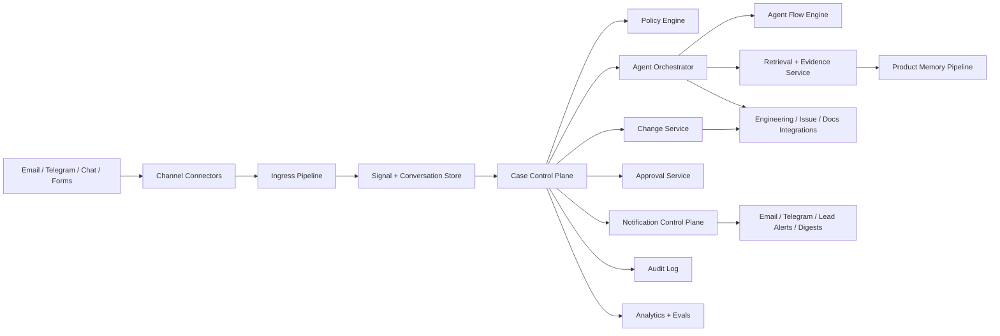

# NestFleet Product Vision

## 1. Product Name

NestFleet is an AI-native product operations platform that acts like a supervised virtual team for one or more products. It listens across communication channels, understands user and product issues, resolves low-risk cases directly, escalates higher-risk work, and drives approved changes through analysis, implementation, release, verification, and learning.

## 2. Vision

Build a virtual team that does not merely imitate a support desk. It should continuously care for the health of a product by combining support intake, user communication, triage, product thinking, change management, engineering assistance, release verification, and knowledge maintenance in one governed system.

The long-term vision is a fleet of AI product teams, each assigned to a product or domain, sharing a common operating platform while preserving product-specific context, policies, and permissions.

## 3. Problem Statement

Small product organizations often have more operational surface area than they can staff:

- inbound questions arrive across fragmented channels
- support issues are not normalized into a reliable process
- repetitive cases consume attention that should go to product improvement
- important signals are lost between support, product, engineering, and release
- change management is inconsistent, slow, or under-documented
- knowledge captured after resolution is rarely fed back into docs, runbooks, or routing logic

The result is a product that accumulates friction faster than the team can remove it.

## 4. Product Thesis

NestFleet should treat support, product operations, and change management as one continuous lifecycle:

`Signal -> Conversation -> Case -> Problem -> Change -> Release -> Verification -> Knowledge`

This is the core thesis:

- user communication is not separate from product insight
- triage is not separate from product prioritization
- change management is not separate from support resolution
- knowledge maintenance is not an afterthought

If these functions share a common control plane, the system can reduce operational load while improving the product over time.

## 5. Product Principles

### 5.1 Human-Governed Autonomy

The system should act aggressively on low-risk repetitive work and conservatively on anything that changes product behavior, user commitments, or production state.

### 5.2 Product Stewardship Over Ticket Throughput

The goal is not to close tickets quickly. The goal is to improve product health, reduce recurring pain, and maintain reliable user communication.

### 5.3 Omnichannel, Single Memory

Users may interact through email, Telegram, chatbots, forms, or in-product feedback. The platform should unify those signals into a shared understanding of the product and the customer.

### 5.4 Policy Before Prompting

The system should be controlled by explicit policies, permissions, state transitions, and approval rules. Prompts alone are not governance.

### 5.5 Learn From Every Resolution

Every resolved issue should be a candidate to update docs, FAQs, known issue lists, routing rules, and evaluation datasets.

### 5.6 Hammer, Not Whale

The product should not attempt to compete head-on with heavyweight enterprise suites such as ServiceNow. It should be narrow enough to remain effective, opinionated, and fast to deploy, while still covering the core operational flows that smaller product teams actually use.

### 5.7 Open Stack by Default

The implementation should prefer mature non-commercial frameworks, open-source libraries, and portable infrastructure choices wherever practical. Commercial dependencies should be optional integrations, not hard platform requirements.

### 5.7.1 Client-Installed, Cloud-Connected

NestFleet should run entirely on the customer's infrastructure. All customer data including cases, conversations, code, and product memory stays on the customer's own systems and never reaches NestFleet infrastructure.

NestFleet Cloud provides a thin update and value-delivery channel that transmits zero customer data. It delivers software updates, evaluation benchmarks, compliance templates, role template improvements, and security patches.

The customer configures their own LLM provider. NestFleet does not proxy model calls.

This model makes NestFleet a software vendor rather than a data processor for customer operational data, which materially reduces the certification burden and removes the trust barrier for customers who are unwilling to share sensitive artifacts with a cloud service.

Details are defined in `docs/monetization-and-licensing-model.md`.

### 5.8 Agentic Flows as a First-Class Architectural Concern

The architecture should be designed around autonomous but governed agent workflows. Agents are not a thin feature on top of a workflow engine. They are core executors inside a policy-bound operational system.

### 5.9 Product Memory as Core Infrastructure

NestFleet should treat product-level retrieval and grounding as core infrastructure, not as an optional chatbot enhancement. Every persona depends on access to current, product-scoped knowledge in order to answer users, route cases, prepare changes, and justify decisions.

The correct model is not generic "RAG" in isolation. It is a governed product memory layer that builds evidence packs from trusted sources with policy filtering, freshness control, and citations.

### 5.10 Ecosystem-Native Injection

NestFleet should be easy to inject into an existing product ecosystem without forcing the customer to rebuild their stack around it.

That means:

- connect to the channels, repos, trackers, docs, and notification paths the customer already uses
- let the customer activate only the roles needed for the current stage of the product
- avoid forcing full process migration before value can be shown
- treat NestFleet as an operational layer that can ramp up or ramp down like a team

### 5.10.1 Fast Adoption Principle

Customers should be able to adopt NestFleet without designing their own agent system from scratch.

That means:

- the default path should rely on shipped role templates, team packs, policies, and connectors
- configuration should focus on selecting and scoping capabilities, not inventing a new orchestration model
- customers should get useful value from activation and integration, not from prompt engineering or agent-topology design
- advanced customization may exist later, but it must not be required for the first meaningful outcome

### 5.11 Configurable Team Composition

NestFleet should not be a fixed bundle of permanently enabled agents. It should behave like a configurable virtual team.

The user should be able to:

- enable only the role templates needed for the product
- disable roles that are not needed yet
- assign different approval rights, tool scopes, retrieval profiles, and notification policies per role
- add or remove "team members" as product needs change
- keep one human holding several lead roles in early stages without breaking the model

The product should therefore optimize for configurable composition of governed roles, not for a single monolithic bot.

### 5.12 Governed Role Improvement

NestFleet should support bounded self-improvement for advanced roles, but not uncontrolled self-modification.

The intended model is:

- observe outcomes
- collect evaluation data
- propose role-profile improvements
- validate those improvements offline or in shadow mode
- promote only reviewed and versioned improvements

This is especially relevant for later advanced roles such as an `L3 Developer` role template. The goal is to improve effectiveness inside a defined problem domain without letting the role rewrite its own safety model, permissions, or business truth in production.

## 6. Goals

### 6.1 Business Goals

- reduce the amount of human labor needed to operate several products
- preserve responsiveness and professionalism across all communication channels
- improve issue-to-change cycle time
- create a reusable platform for multiple products and brands
- increase product quality by turning support load into product improvements

### 6.2 Product Goals

- ingest all meaningful external and internal product signals
- automate low-risk communication and repetitive operations
- produce reliable case triage and escalation
- maintain a product-scoped memory and retrieval layer that grounds every AI persona in trusted product context
- support change management with explicit approval gates
- assist engineering with reproduction, patch drafting, testing, and release preparation
- verify that released changes actually resolve the original issue
- maintain a growing product knowledge base

## 7. Non-Goals

- fully autonomous production changes with no human approval
- replacing all human judgment in prioritization, legal, finance, or security-sensitive matters
- supporting every channel, every product, and every workflow in v1
- modeling the UI directly around old-school ITIL queue structures
- building a heavyweight enterprise ITSM suite to compete directly with ServiceNow-class platforms
- becoming a generic no-code workflow product for every department

## 8. Market Positioning

NestFleet should be positioned as a focused product-operations hammer for small teams with multiple products, not as a broad enterprise operations suite.

### 8.1 Positioning Thesis

- strong enough to cover the operational backbone of support, triage, change management, and follow-through
- lighter, faster, and more agent-native than legacy ITSM platforms
- opinionated around product stewardship rather than enterprise process sprawl
- practical for founder-led or lean product organizations that need leverage more than configurability

### 8.2 Competitive Stance

NestFleet should avoid competing on:

- breadth of enterprise process modules
- massive customization surface
- legacy ITIL completeness for large organizations
- complex service catalog and asset-management feature sets

NestFleet should compete on:

- quality of autonomous operational execution
- time to deploy and value realization
- multi-channel product awareness
- effective change handling with minimal human bandwidth
- open and portable technical architecture
- client-installed deployment that keeps customer data on customer infrastructure
- visible source code under BSL for trust and security audit

### 8.3 Beachhead Customer

The initial product should be designed first for a founder or very small leadership group operating one product end to end. Once the core loops are proven, the same operating model should expand to lean product teams managing several products.

### 8.4 Initial Pilot Recommendation

The first rollout should target one product only, even if several products are in the portfolio.

Resolved decision:

- DocuGardener is the first target product and the first live pilot
- SkillSeal is the second product to onboard after the core loops are stable

DocuGardener is the better first proving ground because it is the selected pilot and should let NestFleet validate communication, triage, notification, and change-preparation flows before expanding to a second product.

### 8.5 Product Boundary Versus Generic Agent Shells

NestFleet should not be framed as "just a collection of agents."

Generic multi-agent tools can provide useful runtime primitives such as isolated agents, tool bindings, and channel access. But NestFleet should differentiate at the product layer:

- canonical support and change-management domain model
- product-scoped memory and evidence packs
- deterministic validation and approval model
- notification control plane
- GitHub-centric change workflow
- compliance-aware operating posture
- configurable team composition tied to product needs

This means generic agent frameworks may be implementation substrates or prototyping tools, but they are not the full product thesis.

### 8.6 Why NestFleet Is Still Worth Building

NestFleet is worth building as a market product only if it remains an opinionated product-operations system rather than a thin wrapper around a generic agent runtime.

That means:

- if the goal is only a private internal setup, OpenClaw-class tools may be enough faster and cheaper
- if the goal is a repeatable product for small teams, NestFleet needs a stronger product layer than generic agent routing provides

The product bet is therefore not "multi-agent access." The product bet is:

- reusable support and change domain model
- configurable team composition
- governed product memory
- deterministic approvals and validations
- notification and escalation control plane
- compliance-aware operational behavior
- later governed role-improvement loops

If NestFleet cannot own those layers, it should not be built as a separate product.

## 9. Core Users and Stakeholders

### 9.1 Product Owner / Founder

Needs a trustworthy virtual team that can operate products with limited budget and limited human bandwidth.

### 9.2 End User / Customer

Needs fast, coherent, respectful help without being bounced between systems or losing context.

### 9.3 Human Approver

Needs visibility into proposed actions, risk, evidence, and expected outcomes before approving a change or communication.

### 9.4 Engineer or Technical Reviewer

Needs reproducible problem statements, prepared context, relevant logs, proposed fixes, and clean handoff into implementation.

## 10. Product Scope

NestFleet should cover eight operating domains:

### 10.1 Channel Operations

- receive signals from email, Telegram, chat widgets, forms, app feedback, and internal channels
- maintain coherent outbound communication
- ask clarifying questions when case data is incomplete

### 10.2 Case Operations

- normalize inbound signals into a canonical case model
- classify issue type, severity, urgency, affected product, and confidence
- detect duplicates and related known issues

### 10.3 Product Operations

- identify recurring pain points and emerging product risks
- distinguish support requests from product defects, docs gaps, incidents, and feature requests
- convert repeated case patterns into backlog candidates or problem records

### 10.4 Resolution Operations

- auto-resolve safe repetitive issues
- draft high-quality human responses
- escalate medium and high-risk cases with evidence

### 10.5 Change Management

- open change requests when product or operational changes are required
- route changes through analysis, approval, implementation, verification, and release communication
- preserve auditability of who proposed, approved, and executed each step

### 10.6 Notification Operations

- emit internal and external notifications for significant events across cases, approvals, changes, releases, and escalations
- support reminders, acknowledgements, escalations, digests, and exception alerts
- differentiate operator-facing notifications from user-facing communications
- ensure notifications are policy-driven, deduplicated, and traceable

### 10.7 Knowledge Operations

- update docs, FAQs, runbooks, and known issue records
- generate evaluation cases from historical successes and failures
- improve routing and policy quality over time

### 10.8 Product Memory and Retrieval Operations

- ingest product documentation, FAQs, runbooks, issue history, repository metadata, release notes, policies, and approved support history
- normalize, tag, version, and index that material into a product-scoped retrieval system
- assemble evidence packs for user communication, triage, problem detection, and PR preparation
- enforce product boundaries, source trust levels, and access controls during retrieval
- track freshness, source lineage, and citation quality for every grounded output

## 11. Virtual Team Model

NestFleet should feel like a team with defined roles, not a monolithic bot.

### 11.1 Channel Agent

Owns inbound and outbound communication for a specific channel. Responsible for message parsing, thread continuity, tone, and missing-information follow-up.

### 11.2 Intake and Synthesis Agent

Creates canonical records from raw signals. Resolves product identity, user identity, issue category, and duplicate relationships.

### 11.3 Product Steward Agent

Determines whether an issue is best treated as support, bug, problem, feature request, docs issue, incident, or change candidate.

### 11.4 Resolution Agent

Handles low-risk repetitive cases using approved runbooks, known issues, and safe tools.

### 11.5 Approval Coordinator

Prepares approval packages for human review, including evidence, risk summary, proposed action, rollback impact, and user communication drafts.

### 11.6 Change Manager Agent

Owns the change lifecycle after approval. Tracks implementation, release readiness, validation steps, and stakeholder communication.

### 11.7 Engineering Agent

Assists with reproduction steps, issue isolation, patch drafts, tests, and pull request preparation.

### 11.8 Release Verifier

Checks that a change was deployed successfully and confirms whether the original issue was actually resolved.

### 11.9 Knowledge Curator

Converts resolved work into durable assets such as FAQs, docs updates, playbooks, known issue mappings, and evaluation data.

### 11.10 Human Lead Model

NestFleet should avoid a deep management hierarchy in early versions. Instead, each end-to-end flow should terminate in a small set of human lead roles with explicit decision rights.

- **Support Lead**: owns user communication quality and final case handling for non-change flows
- **Product Lead**: owns prioritization, feature decisions, and product-behavior tradeoffs
- **Change Lead**: owns approval of change requests and implementation risk acceptance
- **Release Lead**: owns deployment, rollback authority, and release verification sign-off
- **Knowledge Lead**: owns the quality of docs, FAQs, and runbooks where permanent updates are required

In the first deployment, one human may hold several lead roles. Routing should be based on flow type and policy, not a complex org chart.

### 11.11 Minimum Viable Persona Set

The full role model should not become the initial AI persona count. In v1, NestFleet should collapse execution into a minimum viable set of distinct personas:

- **Frontline Persona**: combines channel handling with intake and synthesis. It owns inbound communication, clarification, summarization, and case creation.
- **Steward Persona**: combines product stewardship, low-risk resolution, and approval preparation. It decides whether a case should be answered, escalated, converted into a problem, or turned into a change request.
- **Change Persona**: combines change management and engineering assistance. It prepares change context, proposed implementation, validation notes, and approved PR drafts.

The release verifier should remain modeled in the architecture but should not become a distinct active persona until deployment and post-release verification enter scope.

### 11.12 Role Templates Versus Active Team Members

NestFleet should distinguish between:

- **role templates**: reusable definitions of responsibilities, tools, retrieval profile, notification policy, and approval boundaries
- **active team members**: product-scoped role instances that are currently enabled for a given product

This distinction is important because the product should support configurable team ramp-up without turning every deployment into a custom framework project.

Examples of role templates:

- `Frontline`
- `Steward`
- `Change`
- later `L3 Developer`
- later `Release Verifier`
- later `Knowledge Curator`

Examples of active team-member configuration per product:

- enabled or disabled status
- allowed channels
- allowed issue classes
- tool and integration scope
- retrieval source scope
- notification policy
- mapped human lead role

### 11.13 Team Packs

To keep configuration understandable, NestFleet should prefer curated role packs over free-form complexity.

Examples:

- **Support Core Pack**: Frontline plus Steward
- **Change Pack**: Change plus Change Lead routing
- **Knowledge Pack**: Knowledge-oriented routing and update workflows
- **Incident Pack** later: outage and verification oriented roles

This is a better v1 direction than an open-ended visual agent builder.

### 11.14 Team Visibility as an Operator Experience

The long-term operator experience should make the virtual team visible.

Operators should be able to see:

- which roles are active for a product
- what each role is responsible for
- current workload and blocked states
- pending approvals and escalations
- notification and error conditions per role

This "team board" concept is strategically strong because it makes NestFleet feel like a manageable team rather than an opaque automation engine.

### 11.15 Governed Self-Improvement for Advanced Roles

Some later role templates, especially an `L3 Developer` role, should support bounded self-improvement.

This should mean:

- learning from accepted PR drafts, rejected drafts, review comments, bug recurrence, and validation outcomes
- improving retrieval preferences, patch strategies, implementation heuristics, and task-specific guidance
- versioning each promoted role-profile change

This should not mean:

- unrestricted prompt mutation in production
- self-expansion of permissions
- self-approval of new behaviors
- bypass of human review for risky work

The right long-term model is governed role evolution, not autonomous self-rewriting.

## 12. Canonical Domain Model

The platform should be built around durable objects rather than a single overloaded ticket abstraction.

### 12.1 Signal

One inbound event from any source, such as a message, webhook, form submission, or user feedback item.

### 12.2 Conversation

A sequence of related messages across one channel, mapped to a user or organization when possible.

### 12.3 Case

A specific support, product, or operational issue requiring understanding, action, or communication.

### 12.4 Problem

A repeated or systemic underlying issue inferred from several related cases.

### 12.5 Change Request

A proposed change to code, configuration, content, documentation, policy, or operations.

### 12.6 Release

An execution event that applies an approved change to a target environment.

### 12.7 Knowledge Asset

A durable artifact such as a FAQ, doc page, runbook, known issue entry, or policy rule.

### 12.8 Notification

An internal or external message emitted as the result of an event, state transition, escalation, reminder, or digest rule.

### 12.9 Escalation Policy

A rule set that defines who should be notified, on which channel, with what urgency, and after which timeout or condition.

### 12.10 Product Memory Pack

A curated, product-scoped retrieval context assembled from trusted sources for a specific task such as user reply generation, triage, known-issue matching, or change preparation.

## 13. Core Lifecycle

The platform should run the following core loop:

1. listen for signals
2. understand intent, product context, and severity
3. create or update a case
4. decide whether to resolve, escalate, or convert into a problem or change request
5. if needed, move through change management
6. verify the outcome
7. update communication and knowledge

### 13.1 Case Lifecycle

Suggested initial states:

- `new`
- `enriching`
- `triaged`
- `awaiting-user`
- `awaiting-lead`
- `in-resolution`
- `in-change`
- `pr-drafting`
- `resolved`
- `closed`

### 13.2 Change Lifecycle

Suggested initial states:

- `draft`
- `analysis`
- `approval-pending`
- `approved`
- `implementation-prep`
- `pr-drafted`
- `completed`
- `rejected`

## 14. Autonomy Matrix

Autonomy should be policy-driven.

### 14.1 Actions Suitable for Automatic Execution

- summarize and classify inbound signals
- deduplicate and link related cases
- retrieve knowledge and known issues
- ask clarifying questions
- draft user replies
- open or update internal records
- send routine notifications, reminders, and digests under policy
- run safe read-only diagnostics
- suggest product improvements

### 14.2 Actions Requiring Human Approval

- user-facing commitments about timelines or compensation
- priority and severity changes for high-impact cases
- creation or approval of a change request
- code merge or deployment
- modifications to configuration with product impact
- publication of external incident or release communications

### 14.3 Actions That Should Never Be Fully Automatic in Early Versions

- destructive production operations
- irreversible data modifications
- legal, financial, or security-sensitive decisions without review
- direct execution of high-risk incident responses

## 15. Architecture Outlook

The architecture should be organized as a governed orchestration platform with agent workers inside it.

### 15.1 High-Level Components

- **Channel Connectors**: adapters for email, Telegram, web chat, forms, and internal tools
- **Ingress Pipeline**: normalizes raw events into signals
- **Case Control Plane**: owns state machines, routing rules, policies, and audit trail
- **Team Configuration Service**: manages role templates, active team-member instances, per-product role activation, and capability scoping
- **Agent Runtime**: runs specialized agents with tool access boundaries
- **Agent Flow Engine**: coordinates long-running autonomous workflows, handoffs, retries, wait states, and human checkpoints
- **Notification Control Plane**: transforms important events into alerts, reminders, digests, acknowledgements, and escalations
- **Product Memory Pipeline**: ingests, normalizes, redacts, chunks, tags, versions, and indexes product knowledge sources
- **Retrieval and Evidence Service**: performs policy-aware retrieval, reranking, citation assembly, and task-specific memory-pack generation
- **Role Learning Service**: evaluates role performance, proposes versioned role-profile improvements, and manages review and promotion workflows
- **Approval Service**: human review queue, decision capture, and escalation handling
- **Change Management Service**: change request records, risk summaries, approval chain, release linkage
- **Engineering Integration Layer**: repo, CI, issue tracker, deployment systems, observability tools
- **Analytics and Evals Layer**: quality scoring, cost metrics, routing accuracy, failure review

### 15.2 Architectural Style

Recommended initial style:

- event-driven ingestion
- workflow-driven orchestration for stateful processes
- modular services or modules around durable domain objects
- agent calls as task executors inside deterministic workflow boundaries
- explicit support for long-running agentic flows with approvals, retries, resumability, and audit trails

The key rule is this: agents should not own truth. The platform should own truth. Agents should propose, classify, draft, and act only through governed interfaces.

Recommended orchestration stance for v1:

- prefer queue plus state-machine orchestration in the control plane
- implement agent behavior as bounded workers or tasks invoked by that control plane
- allow code-first workflow logic inside workers, but do not let opaque agent loops become the system of record

This fits AI-agentic systems better than chat-session-centric designs because NestFleet needs explicit states, resumable waits, approvals, retries, audit trails, and policy checks around every consequential action.

Configuration stance for v1:

- support configurable activation of shipped role templates
- support per-role configuration of channels, tools, retrieval scope, notifications, and lead routing
- avoid full arbitrary role-authoring in v1

This preserves flexibility without collapsing NestFleet into a generic agent framework.

Learning stance for later phases:

- roles may improve through versioned profile updates derived from evaluation data
- learning should target retrieval strategy, instructions, heuristics, and task patterns
- policy rules, approval boundaries, and tool permissions must remain separately governed

This keeps role improvement compatible with the deterministic control-plane model.

### 15.3 Product Memory and RAG Requirements

Product-level RAG should be treated as an evidence system, not just a search feature.

- retrieval must be product-scoped and policy-filtered by default
- source systems should include docs, FAQs, runbooks, known issues, GitHub issues, repository metadata, release notes, and approved case history
- every retrieved passage or artifact should carry source id, source type, freshness metadata, and trust tier
- retrieval should combine metadata filtering, lexical search, semantic search, and reranking instead of relying on naive vector similarity alone
- each persona should use a distinct retrieval profile tuned to its task and allowed sources
- outbound communication and important decisions should include citations or evidence references derived from retrieval results
- stale or superseded sources should be detectable so they can be down-ranked or excluded
- retention, deletion, and access-policy changes must propagate into the retrieval layer
- the retrieval layer should support offline evaluation for grounding quality, citation quality, and answer usefulness

### 15.4 Agentic Flow Design Principles

Autonomous flows should be treated as durable business processes rather than ad hoc chat sessions.

- every flow should have a durable state and correlation id
- every handoff between agents should be explicit and observable
- every tool-using action should be bounded by policy
- every wait state should be resumable after timeouts, replies, or approvals
- every terminal outcome should update both business records and evaluation records
- active role configuration should determine which flows are available for a given product
- disabled roles should remove their flows cleanly without breaking the rest of the control plane
- role-improvement loops should consume completed-flow outcomes but should not mutate live production behavior without promotion gates

Example agentic flows:

- inbound issue handling from first message to resolved communication
- known-issue auto-resolution with verification and documentation update
- change request preparation from recurring problem detection to approval package
- engineering assistance from repro plan to PR draft and validation summary
- release verification from deployment signal to user-facing follow-up

### 15.5 Notification Design Principles

Notifications should be treated as part of the control plane, not as a thin UX feature.

- every important event should emit a normalized notification event
- notification rules should support audience, priority, channel, quiet hours, and retries
- the system should support both immediate alerts and digest-style summaries
- acknowledgements and unresolved alerts should feed escalation policies
- user-facing notifications should use separate templates and policies from operator-facing alerts

Minimum notification classes for the first release:

- approval requests
- escalations
- reminders
- digest summaries
- user follow-ups
- PR-ready and change-status alerts

Minimum v1 notification policy baseline:

- default quiet hours should be `20:00-08:00` in the lead holder's local time, plus weekends
- critical alerts such as outage, security suspicion, or blocked high-impact change bypass quiet hours
- critical alerts require acknowledgement within `10 minutes`, escalate to a secondary channel after `10 minutes`, and repeat every `30 minutes` until acknowledged
- high-priority notifications require acknowledgement within `60 minutes` during business hours and should defer to the next business window if created during quiet hours, unless explicitly tagged as outage or urgent customer impact
- normal-priority notifications require acknowledgement within `4 business hours`, with one reminder after `2 business hours`
- low-priority notifications such as digests and knowledge suggestions do not require acknowledgement
- digest notifications should default to `09:00` and `17:00` local time
- non-critical user-facing outbound messages created during quiet hours should queue for the next business window unless a lead explicitly marks them urgent

This baseline is intentionally conservative because the first product posture is internal-operator first rather than aggressive user-facing automation.

### 15.6 Data Boundaries

At minimum, isolate:

- product-specific context and policies
- user and organization data
- conversation history
- case history and decision log
- change management records
- knowledge assets and evaluation cases

This is necessary for both trust and multi-product scalability.

### 15.7 Deployment Model Recommendation

NestFleet should not be designed primarily as a single local app installed on one machine. That model conflicts with always-on channel ingestion, webhooks, notifications, long-running workflows, approval queues, and shared operational state.

Recommended product shape:

- hosted SaaS should be the default operator experience in v1
- the architecture should preserve a clean self-hosted deployment path from the same core codebase
- a local or desktop companion may exist later for setup, debugging, or admin workflows, but it should not be the primary runtime model

Recommended deployment topologies:

- **Hosted SaaS**: NestFleet runs the control plane, agent runtime, notification layer, and product memory layer for the customer
- **Self-Hosted**: the customer runs the same core platform in its own infrastructure
- **Hybrid Later**: hosted control plane with customer-hosted connectors, retrieval stores, or source gateways for stricter data-boundary needs

This gives NestFleet the correct operating shape for a serious product while still aligning with the open, portable, self-hostable requirement.

### 15.8 Suggested Service Boundaries for v1

- `ingest-service`
- `case-service`
- `policy-service`
- `agent-orchestrator`
- `agent-flow-service`
- `product-memory-service`
- `retrieval-service`
- `notification-service`
- `approval-service`
- `change-service`
- `knowledge-service`
- `integration-service`
- `analytics-service`

In the earliest implementation, several of these can live in one deployable application if boundaries are preserved in the codebase.

## 16. Integration Outlook

Likely integration categories:

- communication: Gmail, Outlook-compatible email providers, Telegram, web chat, Slack
- work management: Jira, Asana, Linear, GitHub Issues
- engineering: GitHub, CI pipelines, release tools
- observability: logs, metrics, error tracking, uptime tools
- docs and knowledge: internal docs, Notion, markdown repos, help center content

The integration strategy should be connector-based so each product can enable only the systems it actually uses.

### 16.1 Initial Integration Priorities

The first-party integration backlog should favor tools that are widely used by lean product teams:

- Jira
- Asana
- GitHub
- Gmail and common IMAP/SMTP-compatible email providers
- Telegram
- one website chat widget path

The initial product should avoid a long tail of niche integrations until the core flows are proven.

### 16.1 Ecosystem Injection Model

NestFleet should enter the customer's ecosystem incrementally.

Recommended onboarding order:

- connect channels
- connect GitHub
- connect trusted docs and knowledge sources
- activate Support Core roles
- activate Change roles only when the support loop is stable

This makes NestFleet easier to adopt than a system that demands full toolchain migration on day one.

### 16.2 Work Management System Strategy

GitHub should be a mandatory part of the change-management backbone in early versions.

- the default v1 work-management spine should be GitHub Issues and GitHub Projects
- if a dedicated planning or ticketing system is required, prefer open and self-hostable options before defaulting to commercial tools
- Jira and Asana should be supported as integrations because many teams already use them, but they should not be hard product dependencies

Candidate open or self-hostable options to evaluate include Plane, OpenProject, Taiga, and Redmine.

### 16.3 Channel Rollout Strategy

- v1 should support email and Telegram
- v2 should add an AI chat channel
- later phases can add broader chat and internal collaboration surfaces once the control plane is stable

### 16.4 Product Memory Source Strategy

The initial product memory layer should prioritize sources that are already close to real product truth:

- markdown documentation repositories
- help-center or FAQ content
- GitHub issues, pull requests, labels, and release notes
- runbooks and policy documents
- approved historical cases and known-issue records

The system should avoid indexing uncontrolled or low-trust sources into the same retrieval pool without explicit source-tiering and policy review.

## 17. Technical Principles

### 17.1 Open and Portable Stack

- prefer open-source frameworks and libraries
- require self-hostable or cloud-portable infrastructure patterns unless there is a clear reason not to
- avoid early lock-in to proprietary workflow runtimes unless they provide decisive leverage
- keep agent, workflow, and domain logic separable
- allow paid tools when they provide a clear operational advantage and do not become unavoidable platform lock-in
- prefer OSS choices for database, queueing, orchestration, retrieval, observability, and identity layers in the first version
- permit paid components only where no credible OSS path exists or where the paid option materially reduces delivery or compliance risk

### 17.2 Functional Sufficiency Over Platform Sprawl

The platform should implement the main operational flows well enough to be dependable in daily use. It does not need to model every edge of enterprise service management before delivering value.

### 17.3 Integration Adapters Over Vendor Coupling

Third-party systems should be accessed through adapter boundaries so they can be replaced or added without rewriting core logic.

### 17.4 SaaS-First, Self-Hostable by Design

The primary product should be delivered as a SaaS platform because the operational model requires always-on ingestion, centralized state, notifications, approvals, and long-running workflows.

At the same time, the codebase and architecture should be built so that:

- self-hosting is a real deployment mode, not a future rewrite
- storage, queueing, retrieval, and model-routing dependencies can be swapped for customer-controlled infrastructure
- the hosted and self-hosted variants share the same domain model, workflow behavior, and policy engine

## 18. Safety, Governance, and Audit

Safety is a first-class feature, not a later hardening task.

### 18.1 Governance Requirements

- every model action should be attributable
- every tool call should be logged
- every state transition should be auditable
- every approval should capture actor, rationale, and timestamp
- every automated response should carry confidence and policy basis

Minimum day-one auditability should match the baseline set in `docs/legal-compliance-eu-germany.md`.

At minimum, NestFleet should log:

- signal ingestion metadata and channel source
- actor identity, including human actor or AI persona plus model/version where relevant
- retrieval evidence references used for a decision or message
- action proposal payloads and validation results
- policy checks and execution outcomes
- notifications sent, acknowledged, retried, or escalated
- approvals, rejections, and rationale
- GitHub artifacts created or modified by the Change Persona
- retention, export, deletion, and correction events on governed records
- correlation ids and timestamps across the full flow

### 18.2 Guardrails

- scoped tool permissions per agent role
- policy checks before state-changing actions
- confidence thresholds for automation
- fallback to human review for ambiguity or risk
- environment separation between draft, staging, and production actions

### 18.3 Deterministic Automation Requirements

Absolute hallucination-proof behavior is not a realistic systems requirement for current LLM-based agents. The correct requirement for NestFleet is a deterministic decision envelope with bounded actions, explicit validation, and reliable abstention when evidence is insufficient.

Every AI-involved decision in NestFleet should satisfy the following:

- all material decisions must be expressed as typed action proposals, not free-form agent output
- all action proposals must validate against a schema before they can be processed
- all action proposals must include evidence references from approved sources such as retrieved knowledge, case history, GitHub metadata, or policy documents
- all state-changing actions must pass through a policy engine before execution
- all state-changing actions must be executed through tools or workflow commands, never by trusting raw natural-language output
- all automation paths must define abstain conditions and escalate when evidence, confidence, or policy checks do not pass
- all important decisions must support replay, simulation, and post hoc review
- all automatic actions should be idempotent or reversible wherever practical

### 18.4 Dual Validation and Decision Checking

For any action that changes records, sends user-facing communication, or creates engineering artifacts, NestFleet should use at least two layers of validation:

- **primary decision layer**: the persona produces a typed proposal with evidence and rationale
- **secondary validation layer**: a rule engine, deterministic validator, or verifier model checks that the proposal is grounded, policy-compliant, and internally consistent

High-risk actions should require both machine validation and human approval. Low-risk actions may proceed automatically only when both the proposal and validation layers pass.

### 18.5 Persona-Specific Guardrail Requirements

#### Frontline Persona

- allowed to classify inbound messages, ask clarifying questions, draft replies, create or update conversations and cases, and send routine reminders
- must be grounded only in approved product knowledge, conversation context, and user-visible policies
- must pass tone, compliance, and schema validation before any outbound user communication
- must never invent timelines, compensation, legal commitments, or root-cause claims presented as facts

#### Steward Persona

- allowed to triage cases, map to known issues, propose problem records, prepare approval packages, and initiate change requests
- must provide evidence for severity, routing, and recommended action
- must use deterministic policy thresholds for escalation, low-confidence handling, and known-issue matching
- must never approve its own high-impact action, close ambiguous critical cases silently, or create unsupported product commitments

#### Change Persona

- allowed to prepare change requests, draft implementation context, create GitHub artifacts, and generate PR-ready drafts
- must be grounded in repository context, issue history, policy constraints, and available validation signals such as lint, tests, or static analysis
- must pass repository policy checks before opening or updating engineering artifacts
- must never merge, deploy, modify production systems, or bypass required lead approval

### 18.6 Evaluation Gates for Automation Rollout

Before enabling any automated decision path in production, NestFleet should require:

- shadow mode or review-only trials
- task-specific evaluation sets with pass thresholds
- rollback or disable controls for the relevant automation path
- policy versioning and change history
- routine review of false positives, false negatives, and abstain behavior

## 19. Evaluation and Success Metrics

NestFleet should be measured on product outcomes, not only automation rate.

### 19.1 Operational Metrics

- first response time
- case resolution time
- percent of low-risk cases auto-resolved
- notification acknowledgement time
- escalation latency
- human approvals per change
- change lead time
- release verification success rate

### 19.2 Quality Metrics

- triage accuracy
- duplicate detection accuracy
- response usefulness score
- approval rejection rate
- rollback rate
- false positive and false negative escalation rates

### 19.3 Product Health Metrics

- repeat issue rate
- docs deflection rate
- support volume by root cause
- time from recurring issue detection to change request
- reduction in manual operational load per product

### 19.4 Decision Quality Metrics

- schema-validation pass rate
- secondary-validator disagreement rate
- abstain rate by persona and task type
- unsupported-claim rate in outbound communication
- auto-action rollback or correction rate
- PR draft acceptance rate after human review

## 20. MVP Recommendation

The first release should validate the thesis with minimum complexity.

### 20.1 MVP Scope

- one product
- first target and first live pilot: DocuGardener
- second product after initial stabilization: SkillSeal
- two channels, for example email and Telegram
- canonical signal, conversation, case, and change request records
- minimum viable persona set: Frontline, Steward, and Change
- configurable activation of shipped role templates per product
- product memory and retrieval grounded in docs, GitHub context, known issues, and approved case history
- internal-operator-first posture, with narrow user-facing automation only where grounding and policy are strong
- case triage with confidence scoring
- low-risk auto-response for a narrow class of repetitive cases
- notification control plane for internal alerts, reminders, and approvals
- human approval queue for anything that changes product behavior or makes commitments
- GitHub as the required engineering and change-management backbone
- GitHub Issues and Projects as the default work-management layer
- post-resolution knowledge capture

### 20.2 Initial Issue Classes

The first supported issue classes for DocuGardener should be:

- user requests such as how-to questions, usage guidance, and documentation gaps
- bug reports, including clarification, deduplication, known-issue matching, and GitHub issue preparation
- downtime and outage reports, including acknowledgement, severity routing, lead notification, and status follow-through
- user feedback and feature input, including normalization, summarization, clustering, and backlog routing

The system should automate these unequally:

- user requests are the first class for direct grounded auto-response
- bug reports and outages should prioritize high-quality intake, triage, and escalation over autonomous resolution
- user feedback should prioritize synthesis and routing rather than immediate closure

### 20.3 Full-Cycle Ambition and Delivery Cut

The product vision should cover the full end-to-end cycle from intake to verified release outcome. The recommended delivery strategy is narrower:

- design the architecture from day one for full-cycle execution
- stop the first implementation at approved PR draft
- add deployment coordination and post-release verification as soon as the earlier control loops are stable

### 20.4 What v1 Must Not Attempt

- full autonomy across all products
- production deployments with no approval
- complex incident management automation
- broad channel coverage from day one
- all-in-one enterprise workflow replication
- free-form arbitrary agent designer
- live self-modifying roles in production

## 21. Phased Outlook

### Phase 1: Assisted Operations

Focus on intake, synthesis, drafting, triage, and approval preparation.

### Phase 2: Controlled Resolution

Add safe automated resolutions and workflow-triggered change request creation.

### Phase 3: Engineering Assistance

Add reproduction support, patch drafting, tests, and PR preparation.

### Phase 4: Release and Verification

Add deployment coordination, verification workflows, and customer follow-up.

### Phase 5: Fleet Intelligence

Add governed role-improvement loops, cross-product learning, recurring problem detection, and portfolio-level analytics.

## 22. Risks and Constraints

- hallucinated or overconfident decisions can damage trust
- weak policy design can create unsafe automation
- cross-channel identity resolution is hard
- product-specific context quality may limit agent performance
- evaluation and feedback loops require disciplined curation
- multi-product support introduces isolation and permission complexity

## 23. Current Product Decisions

The current design pass has resolved the following:

- first target product and first live pilot: DocuGardener
- next product after the pilot proves stable: SkillSeal
- first issue classes: user requests, bug reports, downtime or outage reports, and user feedback
- day-one lead model: Support Lead, Product Lead, Change Lead, and Knowledge Lead, with one human allowed to hold several roles in the first rollout
- first product posture: internal-operator first
- notification baseline: conservative business-hours-oriented defaults with critical-alert bypass, as defined in Section 15.5
- day-one auditability: minimum legal and security baseline defined in `docs/legal-compliance-eu-germany.md` and Section 18
- workflow orchestration preference: queue plus state-machine control plane with bounded agent workers
- stack posture: maximum practical OSS and self-hostable components, with paid dependencies allowed only when OSS is not credible enough or introduces more risk than value

## 24. Initial Architecture Sketch

## 25. Recommended Next Documents

After this vision document, the most useful follow-on artifacts are:

1. `docs/domain-model.md`
2. `docs/case-and-change-lifecycle.md`
3. `docs/autonomy-and-approval-policy.md`
4. `docs/notification-model.md`
5. `docs/mvp-scope.md`
6. `docs/system-architecture.md`

## 26. Market-Informed Packaging Hypothesis

As of March 16, 2026, the market mostly prices customer-service platforms in one of four ways:

Detailed competitor notes and source links live in `docs/market-landscape.md`.

- per-agent seat pricing
- seat pricing plus AI add-ons
- seat pricing plus usage-based AI resolutions or outcomes
- open-core or self-hosted pricing with support and credit bundles

NestFleet should not default to a pure per-agent seat model. Its value is not extra agent seats. Its value is replacing operational load with governed automation. The packaging should therefore be based on active products or workspaces, included human lead seats, and included automation volume.

### 26.1 Business Model Recommendation

Recommended starting model:

- open-core product strategy with a hosted SaaS offering
- Free, Pro, and Team hosted plans
- self-hosted deployment available only on Team in the initial commercial model
- usage guardrails based on cases, notifications, validated AI actions, PR drafts, and product-memory scale

### 26.2 Role / Feature / Pricing Plan Matrix

The following matrix is a baseline hypothesis and should be revisited after pilot usage data.

| Plan | Target user | Included lead roles | AI personas | Core features | Suggested limits | Suggested baseline |
| --- | --- | --- | --- | --- | --- | --- |
| Free | Solo founder evaluating NestFleet | 1 active lead holder | Frontline, Steward, Change | Email + Telegram intake, GitHub sync, product memory from docs, GitHub, and known issues, case triage, approval queue, notifications, limited PR drafts | 1 active product, 5 connected memory sources, 100 active cases/month, 500 notifications/month, 50 validated AI actions/month, 3 PR drafts/month | $0 |
| Pro | Founder or very small product team running one serious product | Up to 3 lead holders | Frontline, Steward, Change | Everything in Free plus advanced policies, digests, problem tracking, richer approval flows, knowledge updates, stronger retrieval controls, and higher automation volume | 1 active product, 1 sandbox product, 25 connected memory sources, 1,000 active cases/month, 5,000 notifications/month, 500 validated AI actions/month, 25 PR drafts/month | $99/month |
| Team | Lean team operating one or more products with stronger governance needs | Up to 10 lead holders | Frontline, Steward, Change | Everything in Pro plus multi-product support, custom policy bundles, audit export, SSO, advanced routing, self-hosted option, premium support, and enterprise-grade product-memory controls | Up to 5 active products, 100 connected memory sources, 10,000 active cases/month, 25,000 notifications/month, 2,500 validated AI actions/month, 150 PR drafts/month | $349/month |

### 26.3 Packaging Principles

- every paid plan should include all three AI personas, because splitting personas into add-ons would blur the product story
- plan differentiation should come from governance depth, active products, usage volume, and deployment model
- Free should be generous enough to show real value but strict enough to cap AI cost exposure
- Pro should be the default economic fit for founder-led products
- Team should be the entry point for self-hosting, SSO, advanced auditability, and multi-product operations
- overage pricing, if introduced later, should apply to automation volume rather than human seats
