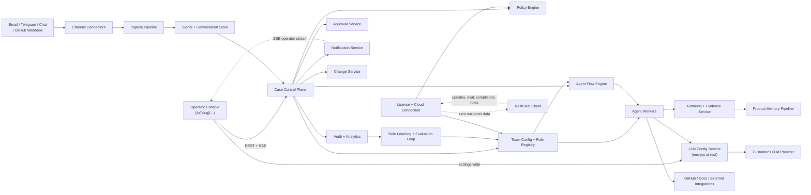

# NestFleet System Architecture

## 1. Purpose

This document defines the reference architecture for NestFleet v1. It is designed to support governed agentic workflows, product-scoped retrieval, deterministic state control, and an OSS-first deployment model.

## 2. Architecture Drivers

- first live product is `Acme`
- v1 is `internal-operator first`
- v1 ends at `approved PR draft`
- queue plus state-machine orchestration is preferred over chat-session-centric design
- product memory is a core subsystem
- configurable team composition is a core operating model
- governed role-improvement is a later strategic capability
- client-installed on customer infrastructure is the default runtime
- all customer data stays on customer systems; NestFleet Cloud provides a thin value-delivery channel transmitting zero customer data
- an optional hosted SaaS tier may be offered later as a premium option
- legal and audit constraints from `docs/legal-compliance-eu-germany.md` are first-order requirements

## 3. High-Level Architecture

## 4. Architectural Style

### 4.1 Control Plane First

The source of truth should live in durable business records and explicit state machines.

The control plane owns:

- case states
- change states
- approval states
- notification states
- validation states

### 4.2 Agent Workers, Not Agent-Owned State

Agents should execute bounded tasks such as:

- summarize
- classify
- retrieve
- draft response
- prepare approval package
- prepare PR draft

Agents should not own long-running truth. They should be invoked by the control plane and return typed outputs.

### 4.3 Modular Monolith First

The recommended implementation for v1 is a modular monolith with strong internal service boundaries.

Reason:

- simpler to ship
- easier to audit
- easier to self-host
- less operational overhead than many small services

Split into separately deployable services only after workload or team scale justifies it.

### 4.4 Configurable Team Topology

The architecture should support configurable composition of shipped role templates.

That means:

- role template definitions should be durable configuration, not prompt snippets hidden in code
- active team members should be product-scoped runtime instances of those templates
- flows, tool scopes, retrieval scopes, and notification rules should derive from active role configuration

v1 should support configuration of shipped roles, not arbitrary free-form role authoring.

### 4.5 Governed Role Improvement

Advanced roles should improve through a versioned promotion workflow, not by mutating themselves live in production.

The allowed learning loop is:

1. collect execution outcomes
2. score outcomes with evaluation pipelines
3. generate improvement candidates for role profiles
4. test those candidates in shadow mode or offline
5. promote reviewed versions into active use

This keeps self-improvement compatible with deterministic governance.

## 5. Core Subsystems

### 5.1 Channel Connectors

Responsibilities:

- receive inbound events from all active channels and normalize to `Signal`
- push signals into the ingress pipeline

**Active channels (v1–v2):**

| Channel | Direction | Notes |
|---------|-----------|-------|
| Email | Inbound + outbound | Postmark; auto-reply and draft-reply delivery |
| GitHub webhooks | Inbound (issues, PR, CI) | `POST /webhooks/github`; outbound via REST API |
| Chat widget | Inbound + outbound | JS snippet served from instance; SSE stream per session |
| Contact form | Inbound | JS snippet; rate-limited by `productId:ip` |
| Slack | Outbound (operator notifications) | Block Kit cards; per-product webhook URL stored encrypted |

All adapters implement the `ChannelAdapter` interface (ADR-005). No channel-specific logic inside the ingress pipeline.

### 5.2 Ingress Pipeline

Responsibilities:

- schema validation of inbound events
- identity hint extraction
- product routing
- deduplication pre-check
- durable signal creation

### 5.3 Case Control Plane

Responsibilities:

- case lifecycle transitions
- correlation across signals, conversations, and cases
- ownership and lead routing
- state transition audit

### 5.4 Team Configuration and Role Registry

Responsibilities:

- store role templates
- store active team-member instances per product
- bind roles to channels, issue classes, tool scopes, retrieval scopes, and lead routing
- expose team composition to the control plane and flow engine

### 5.5 Policy Engine

Responsibilities:

- action allow or deny checks
- approval requirement decisions
- quiet-hours behavior
- prohibited-use enforcement
- product and role scoping

### 5.6 Agent Flow Engine

Responsibilities:

- queue-driven task scheduling
- wait states
- retries
- resumability
- handoff between Frontline, Steward, and Change personas

### 5.7 Agent Workers

Responsibilities:

- run bounded AI tasks
- produce typed proposals
- attach evidence refs
- emit validation records

### 5.8 Product Memory Pipeline

**Full specification**: `docs/product-memory-specification.md`

Responsibilities:

- ingest approved sources from filesystem, GitHub (markdown, OpenAPI, issues, PRs), and operator upload
- classify each document fragment into content type: `prose`, `code`, or `structured`
- apply structure-aware chunking: heading-boundary split for prose (512-token max, 50-token overlap), block extraction for code, NL-summary conversion for structured data (ADR-019)
- assign source tier (T1–T4) per canonical source-type-to-tier mapping (ADR-018)
- apply full chunk metadata: `tier`, `source_type`, `content_type`, `section_path`, `audience`, `language`, `product_version`, `source_updated_at`, `ingested_at`
- compute freshness score at ingestion time using tier-specific staleness windows (ADR-021)
- run conflict detection post-ingestion: semantic neighbour comparison + LLM conflict-check pass, set `conflict_flag` on conflicting chunks
- maintain index updates and deletions (idempotent upsert by content hash)
- compute and persist Documentation Health Report after each ingestion run (ADR-020)
- support webhook-driven, scheduled, and on-demand ingestion trigger modes

### 5.9 Retrieval and Evidence Service

**Full specification**: `docs/product-memory-specification.md` sections 14 and 3.3

Responsibilities:

- hybrid retrieval: `(0.7 × vector_score + 0.3 × fts_score) × freshness_score`
- mandatory metadata filters: `product_id`, `audience` (enforced by policy engine for external actions)
- optional filters: `tier_min`, `product_version`, `content_type`
- tier-weighted reranking: T1 promotion, FAQ boost for question-like queries, conflict demotion, low-freshness demotion
- evidence pack assembly: top-5 chunks + tier summary + freshness summary + conflict flag
- abstain signal computation: checks `insufficient_tier`, `stale_evidence`, `knowledge_conflict`, `capability_disabled`, `audience_violation`; if any condition met, returns `abstain: true` with reason — the persona never runs
- citation generation: each evidence chunk is cited by source URI and section path in persona prompt
- Documentation Health capability gate enforcement: rejects action if required capability is disabled per health report

### 5.10 Approval Service

Responsibilities:

- approval queue
- decision capture
- rationale capture
- approval notifications

### 5.11 Notification Service

Responsibilities:

- notification creation
- deduplication
- scheduling
- retries
- escalation
- acknowledgement tracking

### 5.12 Change Service

Responsibilities:

- change request lifecycle
- GitHub issue linking
- implementation context
- PR draft state
- CI verification tracking (v1.1): webhook ingestion for `pull_request.merged`, `check_suite.completed`; auto-advance CR state machine; CI failure notification emission

### 5.13 Audit and Analytics

Responsibilities:

- immutable audit events
- operational metrics
- automation quality metrics
- disagreement and abstain tracking

### 5.14 LLM Configuration Service

**Architectural decision:** ADR-017, ADR-030

Responsibilities:

- accept LLM provider configuration (provider, model, API key, base URL) from operator at setup time and via Settings → LLM
- encrypt API keys at write time using `encryptSecret()` (AES-256-GCM; `src/shared/crypto.ts`) before persisting to `products.llm_config JSONB`
- decrypt API keys at read time inside the LLM provider factory (`src/agents/llm-provider.ts`) before constructing the provider client — never in API response serialization
- expose only masked key hint (`****xxxx`) via `maskApiKey()` in settings API responses — raw key never appears in any HTTP response
- provide `GET /api/v1/products/:id/settings` and `PUT /api/v1/products/:id/settings` for runtime reconfiguration
- support five provider adapters (OpenAI, Anthropic, Google, Azure OpenAI, self-hosted Ollama) via the Vercel AI SDK factory (ADR-022); provider switching is a config-only operation

Console UX contract (ADR-032):
- API key field renders as a **locked read-only display** showing `apiKeyLast4` when a saved key exists; operator clicks "Change" to unlock an editable input
- unlock input uses `autoComplete="new-password"` to prevent browser password-manager autofill
- `LlmSection` is remounted via `key={productId}` on every product switch to reset local state from fresh props

### 5.15 Operator Console (Multi-Product)

**Architectural decision:** ADR-031, ADR-032

The operator console is a Next.js App Router application. Post-DEFERRED-21 it is fully multi-product.

**URL structure:** `/p/[slug]/cases`, `/p/[slug]/settings`, `/p/[slug]/queue`, etc. The URL slug is the canonical product selector at all times.

**Route group layout:** `console/src/app/(app)/p/[slug]/layout.tsx` mounts `<ProductProvider key={slug} slug={slug}>`. The `key={slug}` forces a full React subtree remount on slug change, atomically resetting all product-scoped context and child state before the async refetch begins.

**ProductProvider:** fetches the full product list from `GET /api/v1/products`, resolves the active product by slug, and exposes `{ product, products, productId }` via React context. All page code reads the current product ID exclusively via `useProductId()` or `useProductIdWithFallback()` hooks — no page may reference `process.env.NEXT_PUBLIC_PRODUCT_ID` directly.

**Product switcher:** sidebar `ProductSwitcherDropdown` shows all accessible products with per-product unread-badge counts. `Cmd+K` palette supports keyboard-driven product switch. MRU + pins for operators managing many products.

**Navigation:** middleware in `console/src/middleware.ts` handles: `/` → `/p/${lastSlug}/queue` (cookie-driven); `/cases` → `/p/${lastSlug}/cases` (legacy bookmark redirect). `nf_last_product` cookie is set on every product page visit as a UX hint for returning users.

**Post-login redirect:** `console/src/app/login/page.tsx` fetches `GET /api/v1/products` after authentication and redirects to `/p/${firstSlug}/cases`, ensuring the user always lands inside `ProductProvider`.

**Section isolation (ADR-032):** every settings section component is rendered with `key={productId}` to force remount on product switch and prevent stale `useState` initialization from the previous product's data.

**Single-product compatibility:** `useProductIdWithFallback()` falls back to `NEXT_PUBLIC_PRODUCT_ID` env var when called outside `ProductProvider`, preserving backward compatibility for existing single-product deployments.

### 5.17 License and Cloud Connection

Responsibilities:

- license file validation (verify signed JWT at startup)
- feature gate enforcement (check tier before enabling gated features)
- usage tracking (count AI actions per month, local only)
- cloud connection for update delivery, evaluation benchmarks, compliance templates, role template updates, and security advisories
- aggregate metadata reporting (zero customer data)

**License Propagation Protocol (LPP — SAD-04):**

NestFleet implements the PlatformCloud License Propagation Protocol for lease-based validation with server-driven scheduling.

| Mechanism | Detail |
|-----------|--------|
| **Lease scheduling** | PlatformCloud returns `lease.ttl_seconds` + `lease.jitter_seconds` in the validation response. NestFleet schedules the next refresh via a `setTimeout` chain: `delay = ttl_seconds * 1000 + random(0, jitter_seconds) * 1000`. Replaces the previous fixed 6-hour `setInterval`. |
| **config_version / 304** | Each validation request sends `cached_config_version`. If the server's config is unchanged it returns `304 Not Modified` — NestFleet resets the lease timer without mutating state, saving a response-parse round trip. |
| **Cloud status state machine** | PlatformCloud may return `status: "active" \| "grace" \| "read_only" \| "revoked"`. NestFleet stores this as `_cloudStatus` and exposes it via `getLicenseCloudStatus()`. The `requireLicenseActive()` Hono middleware reads this: `grace` → passes with `X-License-Status: grace` header; `read_only` / `revoked` → 403. |
| **Pending changes** | Validation response may include `pending_changes[]` — a delta of discrete scheduled changes (plan upgrade/downgrade, feature add/remove, quota change, revocation). Stored separately from `features[]` and rendered by `PendingChangesNotice` as individual rows. Never rendered as the full feature set (Acme bug pattern avoided). |
| **Offline degradation** | On cloud fetch failure: `_offlineWarning = true` and a yellow banner is shown in the console. If the cloud has been unreachable for ≥ 24 hours (`lastValidatedAt` check), `_cloudStatus` autonomously transitions to `"read_only"` per C-05. On next successful validation the state is restored. |
| **HMAC verification** | Cloud refresh responses optionally signed with HMAC-SHA256 (`X-Refresh-HMAC` header) when `CLOUD_REFRESH_HMAC_SECRET` is set. Verified via `verifyValidateResponse()` using `crypto.timingSafeEqual()` (SEC-M4). |

**Capability Manifest Push (SAD-06 / NF-MAN-01/02):**

On startup (after first successful `refreshFromCloud()`), NestFleet pushes a `ProductCapabilityManifest` to PlatformCloud via `PATCH /api/v1/admin/products/nestfleet/capabilities`.

| Mechanism | Detail |
|-----------|--------|
| **Manifest source** | Built from `FEATURE_CATALOG` (38 features, 8 groups) by `buildManifest()` in `src/license/manifest.ts`. |
| **Gate types** | Feature has `featureFlag` → `gate: "flag"`, key = `featureFlag`. Feature has no `featureFlag` → `gate: "tier"`, key = feature id, `min_tier` = `feature.minTier`. |
| **comingSoon exclusion** | Features with `comingSoon: true` are excluded from the manifest (not yet available). |
| **SHA-256 debounce** | `pushCapabilities()` hashes the serialized manifest. If the hash matches `_lastPushedManifestHash`, the push is skipped — prevents repeated pushes of unchanged manifests. |
| **Quota dimensions** | Fixed set: `outcome_units_monthly`, `active_products`, `lead_slots`, `users`. |
| **Auth** | Bearer `PLATFORM_CLOUD_TOKEN`. Silently skips push if token is not configured. |

**Console surfaces (NF-LPP-03/04/06):**

| Component | Location | Trigger |
|-----------|----------|---------|
| `LicenseStatusBanner` | `AppLayout` (above main content) | `cloudStatus ∈ {grace, read_only, revoked}` or `offlineWarning = true` |
| `PendingChangesNotice` | Settings → License section | `pendingChanges.length > 0` (admin only) |

### 5.18 Role Learning and Evaluation Loop

Responsibilities:

- collect outcome data from completed flows
- build evaluation sets from accepted and rejected work
- generate role-improvement candidates
- score candidates against task-specific benchmarks
- support shadow testing and staged rollout of new role-profile versions

## 6. Data Architecture

### 6.1 Primary System of Record

Recommended default:

- `PostgreSQL` as the primary system of record

Use it for:

- domain records
- state transitions
- audit references
- notification scheduling metadata
- approval and validation records

### 6.2 Queueing and Worker Coordination

Recommended default:

- durable workflow state in `PostgreSQL`
- worker execution queue backed by OSS infrastructure

Practical v1 options:

- `Redis` plus worker queue library, with PostgreSQL still owning state
- or PostgreSQL-backed jobs if operational simplicity is more important than throughput

The key rule is that the queue is an execution trigger, not the source of truth.

### 6.3 Product Memory Storage

Recommended default:

- `PostgreSQL` full-text search plus `pgvector` for v1 hybrid retrieval
- object storage for raw documents and artifacts

This keeps the stack compact and self-hostable while still supporting product-level RAG.

### 6.4 Artifact Storage

Use S3-compatible object storage for:

- raw payload snapshots where allowed
- imported docs
- generated artifacts
- audit attachments

### 6.5 Role Profile Versioning

The system should store versioned role profiles separately from runtime task state.

Each promoted role-profile version should track:

- role template id
- version id
- change summary
- evaluation set used
- benchmark outcome
- reviewer or approver
- promotion timestamp

## 7. Reference OSS Technology Baseline

This is a reference stack, not a lock-in decision.

| Concern | Preferred direction |
| --- | --- |
| application runtime | TypeScript (Node.js), Hono web framework |
| operator console | Next.js App Router, React, Tailwind CSS; multi-product routing via `/p/[slug]/` route group |
| primary database | PostgreSQL |
| queue and coordination | pg-boss (PostgreSQL-backed job queue, ADR-025) |
| product memory | PostgreSQL full-text search + pgvector (ADR-006) |
| LLM integration | Vercel AI SDK v4 with provider factory (ADR-022) |
| secret storage | AES-256-GCM via `src/shared/crypto.ts` (ADR-030) |
| object storage | MinIO or S3-compatible storage (ADR-012) |
| observability | OpenTelemetry + Prometheus, Grafana, Loki, Tempo or equivalent |
| identity | JWT (HS256); OIDC-compatible boundary for future (ADR-009) |
| real-time console push | SSE operator stream (`GET /api/v1/products/:id/events`) |

## 8. Primary Runtime Flows

### 8.1 Inbound Support Flow

1. connector receives a message
2. ingress pipeline creates a signal
3. case control plane creates or updates a case
4. agent flow engine schedules Frontline
5. Frontline returns typed summary or clarification proposal
6. policy engine and validator decide auto-send or lead review
7. notification service emits internal and external follow-up as needed

The exact flow is available only if the corresponding role template is active for the product.

### 8.2 Case-to-Change Flow

1. Steward determines the case requires a change
2. change request draft is created
3. approval service requests Change Lead decision
4. on approval, Change prepares repo context
5. Change creates PR draft or patch package
6. audit and notification layers record and announce the outcome

### 8.3 Product Memory Flow

1. approved source is registered
2. product memory pipeline ingests and chunks content
3. content is tagged with trust and freshness metadata
4. retrieval service indexes and exposes task-specific retrieval
5. agent worker requests a memory pack for its task
6. evidence refs are attached to the proposal

### 8.4 Role Improvement Flow

1. completed tasks emit outcome data, review notes, and validation results
2. evaluation pipelines identify repeated failure and success patterns
3. role learning generates a candidate role-profile update
4. candidate runs in offline evaluation or shadow mode
5. approved profile version is promoted into the role registry

The live role should not mutate itself directly during normal execution.

## 9. Team Configuration Model

### 9.1 Role Template

A role template should define:

- role name
- responsibilities
- allowed issue classes
- allowed channels
- allowed tools and integrations
- retrieval profile
- notification profile
- approval boundaries

### 9.2 Active Team Member

An active team member is a product-scoped enabled instance of a role template.

It should define:

- enabled or disabled status
- assigned product
- current lead mapping
- schedule and availability policy
- any product-specific overrides allowed by policy

### 9.3 v1 Configuration Boundary

v1 should support:

- enable or disable shipped role templates
- per-product overrides for channels, tools, retrieval scope, and lead mapping

v1 should not support:

- arbitrary user-authored role DSL
- arbitrary free-form flow builder
- unconstrained prompt editing as the main configuration mechanism

### 9.4 Later Role-Improvement Boundary

Later phases may support:

- versioned improvement of shipped advanced roles such as `L3 Developer`
- per-product adaptation of retrieval strategy and task heuristics

Later phases should not support:

- live self-modification of policy rules
- live tool-permission expansion by the role itself
- unreviewed promotion of role-profile changes

## 10. Security and Compliance Cross-Cutting Controls

- RBAC on every operator and lead-facing action (see `docs/autonomy-and-approval-policy.md` §16 for the full RBAC matrix covering 6 roles, 28 endpoint guards, and sidebar/action-button visibility rules)
- tenant and product isolation
- immutable audit events
- **secrets encrypted at rest**: LLM API keys and webhook secrets stored as AES-256-GCM ciphertext (ADR-030); raw keys never appear in API responses or logs; `ENCRYPTION_KEY` env var required in production
- secret management outside prompt context
- policy checks before every state-changing action
- redaction and minimization before external model calls
- retention and deletion propagation into the retrieval layer
- role-profile promotion only through reviewed version changes
- **license validation**: `jwt.verify()` pins `algorithms: ["HS256"]` (SEC-C2); hardcoded `LICENSE_SECRET` default removed (SEC-C1); optional HMAC-SHA256 signature on cloud refresh response (SEC-M4)
- **admin token comparison**: `crypto.timingSafeEqual()` for all admin bearer token checks (SEC-H3)

## 11. Deployment Topologies

### 11.1 Client-Installed (Default v1 Mode)

NestFleet runs entirely on the customer's infrastructure:

- customer operates the full stack: NestFleet engine, PostgreSQL, queue, storage
- all customer data (cases, conversations, code, product memory) stays on customer systems
- customer configures their own LLM provider (OpenAI, Anthropic, or self-hosted Ollama)
- NestFleet does not proxy model calls; data goes to the customer's chosen provider under their own agreement
- a thin cloud connection to NestFleet Cloud delivers updates, evaluation benchmarks, compliance templates, role template improvements, and security patches
- the cloud connection transmits zero customer data (only license ID, version, aggregate usage counts, error type codes)

### 11.2 NestFleet Cloud (Thin Service)

NestFleet Cloud is not a hosted runtime. It is a value-delivery service:

- license validation for update pulls
- software update delivery
- evaluation quality benchmarks (aggregate anonymized patterns, no individual customer data)
- compliance template bundles
- role template improvements
- security advisories

### 11.3 Optional Hosted Tier (Later)

A hosted SaaS tier may be offered later as a premium option:

- NestFleet runs the full stack on NestFleet-managed infrastructure
- requires full processor DPA and appropriate certifications (SOC 2, BSI C5)
- deferred until client-installed model proves revenue viability and certification investment is justified

Details are defined in `docs/monetization-and-licensing-model.md`.

## 12. Scaling Strategy

### 11.1 Scale by Workflow Volume First

Early bottlenecks are likely to be:

- connector throughput
- retrieval latency
- notification fan-out
- GitHub interaction rate limits

### 12.2 Separate by Concern Before Separate by Service

First optimize:

- worker pools
- queue partitions
- retrieval performance
- artifact storage

Only then split the modular monolith into multiple deployables if needed.

## 13. Architectural Non-Goals for v1

- service sprawl
- custom workflow builder platform
- multi-region active-active design
- deployment automation
- broad incident management suite parity
- arbitrary role authoring DSL
